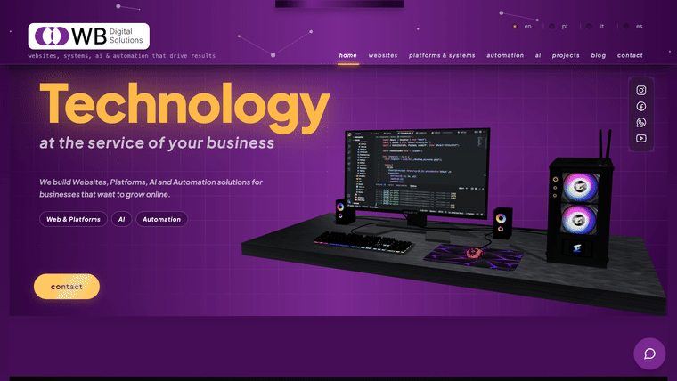
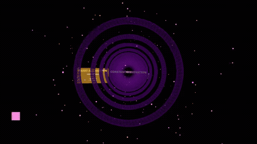
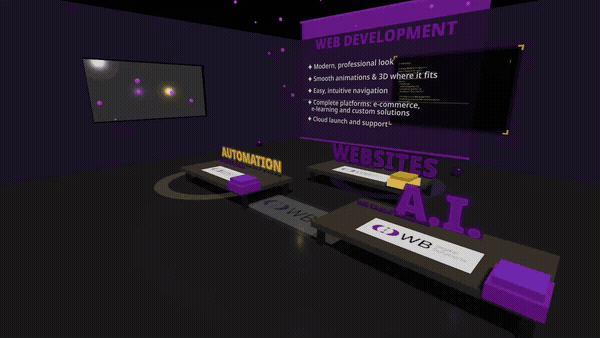

# WB Digital — Interactive 3D Website

An **interactive 3D marketing site** built with Next.js and React Three Fiber — custom GLSL shaders, GLTF scenes, post-processing and physics, choreographed with GSAP.

🔗 **Live demo:** https://www.wbdigitalsolutions.com

[](https://github.com/wbrunovieira/wbdigitalsolutionsnextjsthreejs/actions/workflows/ci.yml)
[](LICENSE)


## ✨ 3D in motion

| Home — orbiting hero | Hyperspace tunnel | Virtual 3D office |
|:--:|:--:|:--:|
|  |  |  |

> Live: **[wbdigitalsolutions.com](https://www.wbdigitalsolutions.com)** · immersive routes `/3d-tunnel` and `/sala-3d`

## Highlights

- **React Three Fiber + Three.js** — declarative 3D scenes: an office showcase, an animated tunnel (with an enhanced variant), and a "canvas text masterclass" scene.
- **Custom GLSL shaders** — hand-written vertex/fragment shaders, including a **GPU simulation pass** (`simVertex.glsl` / `simFragment.glsl`).
- **Post-processing & physics** — effects via `@react-three/postprocessing` and rigid-body physics via `@react-three/rapier`.
- **GLTF models** — desktop and planet scenes loaded through Drei.
- **Motion** — GSAP and Framer Motion for scroll-driven and UI animation.
- **Robust, performance-minded canvas** — preloaded / pauseable canvases and a WebGL error boundary.

## Architecture

- **Next.js 15 (Pages Router)** · React 18 · TypeScript (strict mode).
- **3D** via React Three Fiber + Three.js + Drei, hand-written GLSL and a GPU simulation pass; post-processing and Rapier physics.
- **i18n** — 4 locales (`en`, `pt-BR`, `it`, `es`) with URL-per-locale routing and **SSR-correct, per-page localized metadata**: title, description, canonical, full hreflang matrix and Open Graph cards.
- **Layout** — `Layout.tsx` wraps every page with Nav + Footer + ChatBot; full-screen 3D routes (`/3d-tunnel`, `/sala-3d`) opt out.
- **Source map** — `src/pages` (routes + `api/`), `src/components` (incl. `canvas/` for 3D), `src/contexts` (i18n), `src/locales` (translations), `src/hooks`, `src/lib`, `public/models` (`.glb`/`.gltf`).

## Performance

3D is expensive, so the site is engineered to stay fast: canvases are **lazy-mounted and pauseable**, the heavy 3D scene **mounts on first user gesture**, `ssr:false` sections **reserve height to avoid layout shift**, and a **WebGL error boundary** keeps a shader failure from taking down the page. Textures are optimized offline (`scripts/optimize-desktop-textures.mjs`).

## Quality & CI

Every push runs [`.github/workflows/ci.yml`](.github/workflows/ci.yml):

- **Lint · Typecheck · Production build** — `next lint`, `tsc --noEmit`, `pnpm build`.
- **SEO gate** ([`scripts/i18n-seo-check.mjs`](scripts/i18n-seo-check.mjs)) — auto-discovers every page from the filesystem + content sources (a new page or post is covered the day it lands) and, for **every page × 4 locales**, asserts: non-empty localized `<title>` and description, self canonical, the full hreflang matrix (4 locales + `x-default`), `og:url` = canonical, correct `<html lang>`, and that non-English renders actually differ from English — plus page ↔ `sitemap.xml` parity, both ways. **Zero runtime dependencies**: the metadata is server-rendered, so a plain `fetch` sees everything a browser would.
- **Post-deploy verification** — once Vercel promotes a production deployment, the same gate re-runs against the **live** site, joined by a headless-browser (Playwright) check for the client-side routing behaviour the fetch gates can't observe.

Philosophy: SSR-first gates via `fetch` (fast, dependency-free, on every push); a real browser is reserved for the few things that only manifest client-side.

## Run locally

```bash
pnpm install
pnpm dev          # http://localhost:3000
```

Same checks the CI runs:

```bash
pnpm lint                          # ESLint
npx tsc --noEmit                   # type-check
pnpm build                         # production build
node scripts/i18n-seo-check.mjs    # SEO gate (against a running server)
```

## Tech stack

Next.js · React · TypeScript · **Three.js** · @react-three/fiber · @react-three/drei · @react-three/postprocessing · @react-three/rapier · @react-spring/three · **GLSL** · GSAP · Framer Motion · Tailwind CSS · Playwright · Vercel
